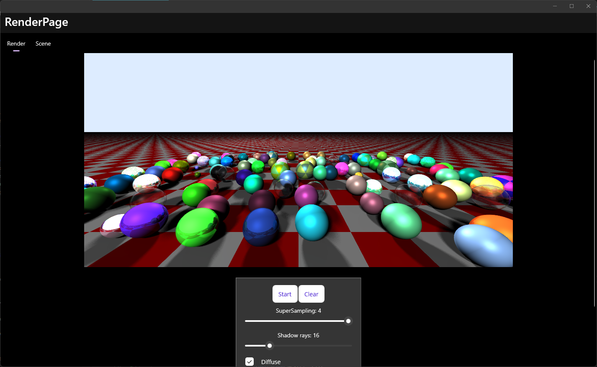

# MauiRaytracer

A simple C# raytracer ported to dotnet maui

Click "Scene" -> "Randomize" to generate some random objects

Camera parameters can be modified under `MainPageViewModel.GetDefaultScene`

TODO: allow editing of all scene properties via UI